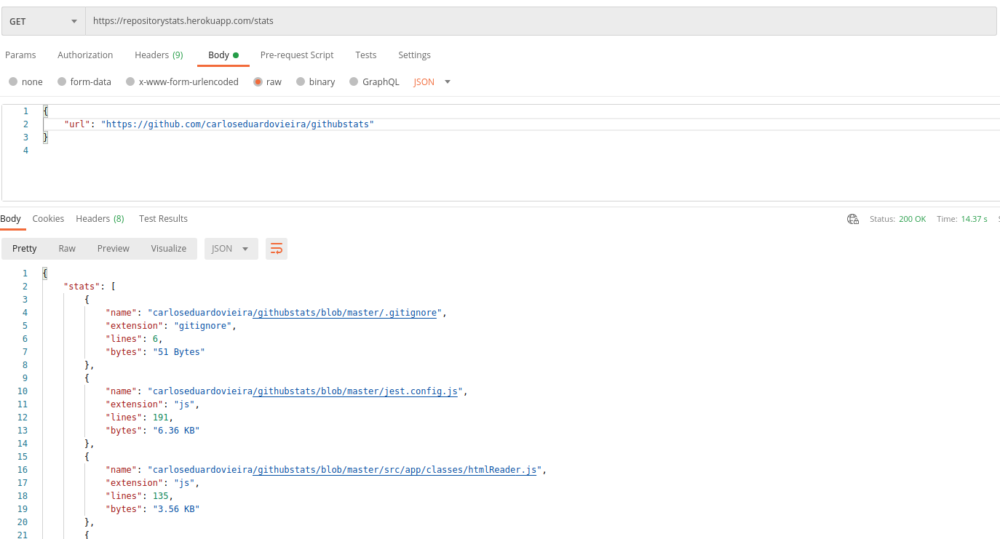

# GITHUB STATS
This project is an API created with node and aims to return all files from a specific repository informed in the body of the GET request.

<h1 align = "center">
  
</h1>

# Technologies
- Javascript
- Nodejs
- Jest
- Sequelize
- Postgres

# Interesting points
This project is interesting because it covers the entire process of creating tables and fields in a database using migrations. This is possible through the use of ORM sequelize. It is also possible to view tests using jest.
This project uses a lot of regex to extract information from html, which is a very interesting technique.
